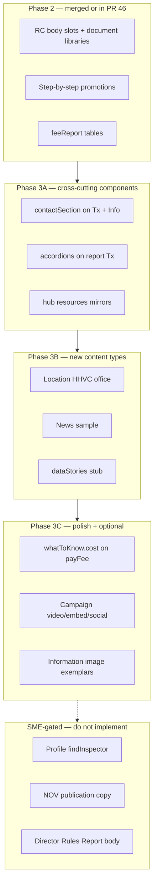

# Karl GitBook Phase 3 — Component Fidelity and Content-Type Gaps

> **For agentic workers:** Use checkbox (`- [ ]`) syntax per task. Run verification after each logical chunk, not only at the end.

**Goal:** Close remaining Karl CMS fidelity gaps that the [Karl Editor Help Center GitBook](https://sfdigitalservices.gitbook.io/karl-sf.gov-editor-help-center/llms.txt) can answer — without inventing HHVC facts blocked by SME review.

**Baseline:** PR [#46](https://github.com/ohdaveed/HHVC_manager_review_current_tool_package/pull/46) (`cursor/karl-rc-and-types-77f5`) — 46 pages, RC body slots, document libraries, Step-by-step promotions, `feeReport`.

**Authoritative sources:**

- [karl-content-type-field-reference.md](../source/hhvc-policy/karl-content-type-field-reference.md)
- [2026-07-07-karl-cms-component-documentation.md](../source/hhvc-policy/2026-07-07-karl-cms-component-documentation.md)
- [hhvc-manual-chapter-4.md](../../../hhvc_chapter_drafts/hhvc-manual-chapter-4.md) (14 content types)
- GitBook index: `https://sfdigitalservices.gitbook.io/karl-sf.gov-editor-help-center/llms.txt`

**Tech stack:** Vanilla JS `pages/*.js`, `js/page-render.js`, Zod (`build_scripts/schema.js`), `audit_karl_components.py`, Bun test/validate.

---

## Scope boundaries

### In scope (GitBook + existing repo sources)

- New **Location** page (49 South Van Ness)
- **Contact section** on all Transaction and Information pages
- **Supporting information accordions** on report Transactions (migrate existing “Help and access” depth)
- **Hub `resources[]` mirrors** on `preventHub` and `recordsHub`
- **`whatToKnow.cost`** on `payFee` from FY27 fee doc (tier language, not per-building amounts)
- **`dataStories[]` stub** on `recordsHub`
- **News** sample post linking to `vectorRules`
- Schema/renderer for **Campaign Video / Embed / Social media** (if reviewers need them)
- **Information `image`** on 1–2 exemplar pages (rent-increase pattern from field reference)
- Doc sync: field reference, `AGENTS.md`, `CLAUDE.md`

### Out of scope / SME-blocked (track only)

| Item | Blocker |
| --- | --- |
| `findInspector` → **Profile** | No verified district directory (`pages/find-district-inspector.js` BLOCKED) |
| `noticeOfViolation` publication copy | NOV templates, appeal windows unconfirmed |
| `payFee` live payment `buttonTarget` | Finance/HHVC payment URL pending |
| Full **Director's Rules Report** body | v4.0 sections IV–VII missing (`2026-07-07-directors-rules-v4-gap-analysis.md`) |
| **Agency** page | SFDPH-owned, not HHVC |
| **Document Collection Search** | Specialized file-cabinet pattern; RC + Report suffice for mockup |
| **Event** / **Meeting** full calendar workflows | Only if HHVC requests dated sessions separate from Campaign |

---

## Architecture overview



---

## Phase 3A — Cross-cutting Karl components (highest ROI)

GitBook: [Contact section](https://sfdigitalservices.gitbook.io/karl-sf.gov-editor-help-center/using-karl-the-cms/components/contact-section.md), [Transaction supporting information](https://sfdigitalservices.gitbook.io/karl-sf.gov-editor-help-center/using-karl-the-cms/content-types/building-a-page-by-content-type/transaction/supporting-information-on-a-transaction-page.md), [Resources](https://sfdigitalservices.gitbook.io/karl-sf.gov-editor-help-center/using-karl-the-cms/components/resources.md).

### Task 3A-1: Standard HHVC contact block

**Files:** All 14 Transaction `pages/report-*.js`, `pages/lookup-*.js`, `pages/public-records-request.js`, `pages/pay-healthy-housing-fee.js`; all 19 Information `pages/*-information.js`, `pages/bed-bug-rules-prevention.js`, etc.

- [ ] Define a shared contact constant in `js/utils.js` or duplicate minimally per page (match existing convention — pages are self-contained modules):

```js
contactSection: {
  phone: 'Environmental Health: 415-252-3800',
  email: 'healthyhousing@sf.gov', // confirm with HHVC before publication
  karl: 'Contact section: Environmental Health (standardized footer)',
}
```

- [ ] Add `contactSection` to every Transaction and Information page. **Do not** add to hub Resource Collections (navigation mockups).
- [ ] Remove redundant inline phone paragraphs where `contactSection` duplicates them (e.g. `payFee` “If you need help” — keep one canonical contact path).
- [ ] Verify `renderContactSection()` appears in page footer via `renderPageFooter()`.

**GitBook rule:** Contact section at bottom; do not use custom text blocks for contact info.

### Task 3A-2: Accordions on report Transactions

**Files:** `pages/report-rats-or-mice.js`, `report-cockroaches.js`, `report-bed-bugs.js`, `report-mosquitoes.js`, `report-overgrown-vegetation.js`, `report-garbage-clutter.js`, `report-mold-humidity-condensation.js`, `report-pigeons.js`

- [ ] Move “Get help making your report” / “Help and access” bullets into `accordions[]` on the **last body section** or a dedicated Supporting information section:

```js
accordions: [
  {
    title: 'Language access and privacy',
    karl: 'Supporting information: Accordion — language, privacy, third-party reporting',
    bullets: [ /* existing bullets */ ],
  },
  {
    title: 'Following up on your report',
    karl: 'Supporting information: Accordion — 311 service request number',
    text: [ /* existing paragraph */ ],
  },
],
```

- [ ] Cap at **5 accordions per section** (Karl + `data-checks.js` limit).
- [ ] Remove the standalone “Help and access” section if content is fully migrated (avoid duplicate prose).
- [ ] Add escaping test if new accordion shapes are introduced.

### Task 3A-3: Hub `resources[]` mirrors

**Files:** `pages/prevent-problems.js`, `pages/lookup-building-records.js`

- [ ] Mirror each hub `cards[]` entry into `resources[]` with `karl: 'Resource collection body: Resources'` (same pattern as `report-a-problem.js` and `property-owner-responsibilities.js`).
- [ ] Keep `editorNote` clarifying hub vs document-library distinction.

**Verification (3A):**

```bash
export PATH="$HOME/.bun/bin:$PATH"
bun run validate
python3 audit_karl_components.py
bun test
bun run format
```

Manual: open 2 report Transactions — accordions collapse/expand; contact footer on Tx + Info pages; hub cards unchanged.

---

## Phase 3B — New content types from GitBook

### Task 3B-1: Location page — HHVC office

**New file:** `pages/hhvc-office-location.js`  
**Key:** `hhvcOffice`  
**Type:** `Location`  
**Slug:** `sf.gov/healthy-housing-vector-control-office` (confirm with chapter 3 URL rules)

**GitBook fields to model** ([How a Location page works](https://sfdigitalservices.gitbook.io/karl-sf.gov-editor-help-center/using-karl-the-cms/content-types/building-a-page-by-content-type/location/how-a-location-page-works.md)):

| GitBook field | Mockup mapping |
| --- | --- |
| Title + Description | `title`, `summary` |
| Essential information | `sections[]` — hours, services available in person |
| Getting here | `sections[]` — transit, parking (generic Muni/BART; no invented schedules) |
| Services at this location | `cards[]` → `payFee`, `findInspector`, `recordsHub` |
| Contact | `contactSection` |
| Related | `cards[]` in Related section |

**Wire-up:**

- [ ] Add `<script>` in `index.html` before `js/page-data.js`
- [ ] Add `[pageKey, menuLabel]` to `js/page-data.js` `order`
- [ ] Add file to `build_scripts/validate.js` and `extract-pages.js` `files` arrays
- [ ] Link from `pestsTopic` and `ownerHub` Related cards

**Schema note:** If `type: 'Location'` is not in Zod enum, extend `pageSchema.type` as free-form string (already `min(1)` only) — no enum change needed. Add Location-specific optional fields only if renderer needs them; otherwise use standard `sections[]`.

### Task 3B-2: News sample — Director's Rules announcement

**New file:** `pages/news-directors-rules-v4.js`  
**Key:** `directorsRulesNews`  
**Type:** `News`  
**Slug:** `sf.gov/news-directors-rules-vector-control-update`

- [ ] Abstract + body announcing v4.0 structure improvements; link to `vectorRules` RC and `feeReport` where relevant.
- [ ] `editorNote`: sample outreach page for Karl News type review; not a publication approval.
- [ ] Wire index, page-data, validate, extract-pages.
- [ ] Optional Related card on `vectorRules` and `scopeInfo`.

**Renderer:** Use standard Information-like body unless News-specific hero is needed — add `renderNewsMeta(date)` only if reviewers request date/abstract layout.

### Task 3B-3: Data story stub on recordsHub

**File:** `pages/lookup-building-records.js`

- [ ] Add `dataStories[]` with one embed stub:

```js
dataStories: [
  {
    title: 'Housing complaint trends (preview)',
    text: 'Interactive dashboard embed — confirm DataSF partnership before publication.',
    url: 'https://datasf.org/', // illustrative external stub
    karl: 'Resource collection body: Data stories — embed stub for reviewer preview',
  },
],
```

- [ ] Verify `renderDataStories()` output in dev server.

**Verification (3B):**

```bash
bun run validate   # expect 48+ pages
python3 audit_karl_components.py
bun test
```

---

## Phase 3C — Polish and optional fidelity

### Task 3C-1: `whatToKnow.cost` on payFee

**File:** `pages/pay-healthy-housing-fee.js`  
**Source:** `docs/source/hhvc-policy/2026-07-07-fy27-website-fees.md`

- [ ] Add tier language to `whatToKnow.cost` (e.g. “Fees are certified annually by tier — see fee schedule for amounts”).
- [ ] Ensure Related card → `feeSchedule` remains primary path for dollar amounts.
- [ ] **Do not** invent per-building dollar amounts.

### Task 3C-2: Information image exemplar

**Files:** 1–2 Information pages (e.g. `bed-bug-rules-prevention.js`, `reduce-indoor-moisture.js`)

- [ ] Add `section.image` with placeholder from a known public source (Unsplash pest/housing imagery per superdesign rules) and descriptive `alt`.
- [ ] GitBook: [Image guidance](https://sfdigitalservices.gitbook.io/karl-sf.gov-editor-help-center/using-karl-the-cms/components/images/image-guidance.md) — no text on images.

### Task 3C-3: Campaign optional components (only if requested)

**Schema:** `build_scripts/schema.js` — add optional `video`, `embed`, `socialMedia[]` on page object.  
**Renderer:** `js/page-render.js` + `css/styles.css`  
**Page:** `pages/mosquito-education-workshop.js`

- [ ] Video: external YouTube URL + transcript note in `editorNote`
- [ ] Embed: workshop request form iframe stub
- [ ] Social media: link list per GitBook Campaign page

**Skip this task** unless manager review explicitly asks for Campaign media components.

### Task 3C-4: Validation and audit extensions

**Files:** `build_scripts/data-checks.js`, `audit_karl_components.py`

- [ ] Warn when Transaction or Information page lacks `contactSection`
- [ ] Warn when report Transaction has standalone “Help and access” section AND no `accordions[]` (migration incomplete)
- [ ] Add Location/News to spot-check table in field reference

### Task 3C-5: Documentation sync

| File | Updates |
| --- | --- |
| `karl-content-type-field-reference.md` | Counts (48+ pages); Location, News; contact/accordion gaps resolved |
| `AGENTS.md` | Note standardized contact footer |
| `CLAUDE.md` | Page count; new content types |

---

## Phase 3D — SME-gated backlog (plan only, do not implement)

Track in `review/manager_decision_log.csv` or field reference “Blocked” table:

1. **Profile** — promote `findInspector` when HHVC confirms district directory
2. **Director's Rules Report** — full citable body when v4.0 §§IV–VI restored
3. **Event** — dated mosquito workshop sessions if separate from Campaign
4. **Meeting** — Director's hearing agenda/minutes pattern for NOV escalation
5. **payFee** — live payment URL when Finance confirms

---

## Suggested implementation order

1. **3A-1** Contact section (cross-cutting, GitBook-mandated)
2. **3A-2** Report Transaction accordions
3. **3A-3** Hub resources mirrors
4. **3B-1** Location page
5. **3C-1** payFee cost field
6. **3B-3** Data story stub
7. **3B-2** News sample
8. **3C-2** Image exemplar (optional)
9. **3C-4** Validation extensions
10. **3C-5** Doc sync
11. **3C-3** Campaign media (only on request)

---

## Verification (each PR)

```bash
export PATH="$HOME/.bun/bin:$PATH"
bun run validate
python3 audit_karl_components.py
bun test
bun run format
```

**Manual review checklist:**

- [ ] Contact footer on every Transaction and Information page
- [ ] Report pages: accordions for help/privacy; 311 CTA still first in What to do
- [ ] Location page: hours, transit, contact, services cards
- [ ] Hub navigation unchanged (`cards[]` still primary)
- [ ] No new invented fees, deadlines, or staff phone numbers beyond existing verified copy
- [ ] `show_karl_tags` toggles new Karl placement notes correctly

---

## Branch strategy

Branch from `cursor/karl-rc-and-types-77f5` (or `main` after PR #46 merges):

```
cursor/karl-gitbook-phase-3-77f5
```

Stack PR on Phase 2 branch until merged, then retarget to `main`.

---

## Risk notes

- **Contact email `healthyhousing@sf.gov`** — confirm with HHVC; use `editorNote` if uncertain.
- **Accordion migration** — do not hide mandatory compliance steps in accordions (chapter 4 Rule 3).
- **Location hours** — use generic “By appointment / check 311” if exact hours are unverified.
- **News/Event dates** — use clearly labeled illustrative dates in `editorNote`.
