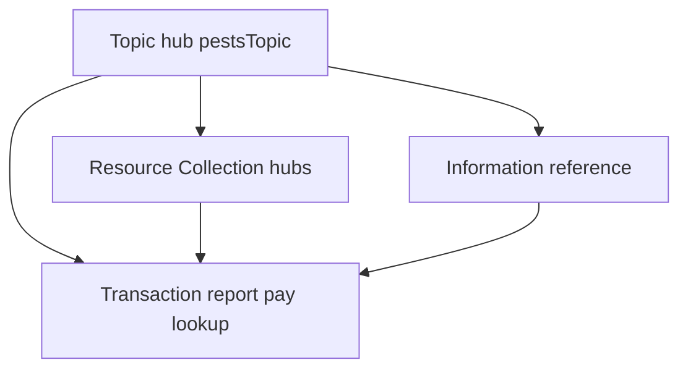

# SFDPH Healthy Housing and Vector Control

## **Chapter 3: Information Architecture Standards**

_HHVC Web Governance and Content Standards Manual_

| **Field**                   | **Value**                                                               |
| :-------------------------- | :---------------------------------------------------------------------- |
| **Document status**         | Version 3.2 Release Candidate                                           |
| **Version**                 | 3.2                                                                     |
| **Date**                    | July 7, 2026                                                            |
| **Status**                  | Approved Working Draft                                                  |
| **Primary standard**        | SF.gov and Karl CMS Editor Help Center                                  |
| **Project source of truth** | HHVC Web Governance and Content Standards Manual source-of-truth update |
| **Tracking tool**           | Content governance tracker in the SF.gov publication repository         |

---

### **3.1 Purpose**

This chapter defines how Healthy Housing and Vector Control (HHVC) content is organized on SF.gov. It establishes the Topic-first information architecture, navigation depth limits, URL conventions, and cross-linking rules that keep residents on task without requiring knowledge of departmental structure.

**Note:** San Francisco Administrative Code Chapter 3 (City property IPM) is a separate legal document. See `docs/source/hhvc-policy/2026-07-07-sf-admin-code-chapter-3-ipm.md` for City-facility pesticide policy only.

---

### **3.2 Topic-First Model**

SF.gov groups services by resident need, not by org chart. HHVC publishes under one primary Topic hub:

| Element            | Standard                                                                                                                     |
| :----------------- | :--------------------------------------------------------------------------------------------------------------------------- |
| **Parent Topic**   | `Pests and housing problems` (`pestsTopic` in the mockup inventory)                                                          |
| **Topic creation** | Digital Services only — HHVC editors tag child pages, they do not create new Topic pages                                     |
| **Auto-assembly**  | Tagging a Transaction, Step-by-step, or Information page with the parent Topic adds it to the Topic hub "More services" grid |
| **Manual linking** | Information pages and external resources still need Related cards or body links when they are not auto-tagged                |

---

### **3.3 Three-Click Rule**

Residents should reach any HHVC **service action** in no more than **three clicks** from the Topic hub:

1. **Click 1:** Land on Topic hub (`Pests and housing problems`).
2. **Click 2:** Choose a task card (report, pay fee, lookup, prevention guide).
3. **Click 3:** Start the Transaction (311 button, payment CTA, or lookup tool).

**Depth exceptions (allowed):**

- Information pages that explain scope, law, or prevention before a report (e.g., bed bug rules before `Report bed bugs`).
- Resource Collection hubs (`Report a problem`, `Prevent problems`) that route to specific Transaction pages.

**Prohibited depth:**

- Burying report paths inside Accordions.
- Requiring users to read long biology sections before finding the 311 CTA on a Transaction page.

---

### **3.4 Approved Page Layers**

| Layer                   | HHVC examples                        | User goal                |
| :---------------------- | :----------------------------------- | :----------------------- |
| **Topic**               | Pests and housing problems           | Orient and route         |
| **Resource Collection** | Report a problem; Prevent problems   | Choose a sub-task        |
| **Transaction**         | Report rats; Pay Healthy Housing fee | Complete one action      |
| **Information**         | IPM for owners; Bed bug rules        | Understand before acting |
| **Step-by-step**        | (Reserved) NOV correction journeys   | Multi-stage compliance   |

---

### **3.5 URL and Slug Conventions**

| Page type           | Pattern                     | Example                                                                          |
| :------------------ | :-------------------------- | :------------------------------------------------------------------------------- |
| Topic               | `sf.gov/topic-[slug]`       | `sf.gov/topic-pests-and-housing-problems`                                        |
| Transaction         | `sf.gov/[verb-slug]`        | `sf.gov/report-rats-or-mice`                                                     |
| Information         | `sf.gov/information/[slug]` | `sf.gov/information/integrated-pest-management-for-property-owners-and-managers` |
| Resource Collection | `sf.gov/[slug]`             | `sf.gov/report-a-problem`                                                        |

Rules:

- Lowercase, hyphenated slugs; avoid filler words (`and`, `the`, `of`).
- Transaction titles start with a verb; URLs mirror the title where possible.
- Short URLs for print require Digital Services approval.

---

### **3.6 Navigation and Related Content**

| Component      | IA role                                                                        |
| :------------- | :----------------------------------------------------------------------------- |
| **Related**    | Next logical task on Transaction and Information pages (right panel or bottom) |
| **Resources**  | PDF and external links on Topic and Resource Collection pages                  |
| **Topics tag** | Publishes child pages to the Topic hub automatically                           |
| **Body links** | Descriptive text; no "click here"; prefer SF.gov pages over PDFs               |

Every Transaction page must answer within five seconds:

1. Who is this for?
2. What is the one action?
3. What happens after I submit?

---

### **3.7 Sitemap Governance**

- The approved page inventory lives in `js/page-data.js` (`order` array) and the mockup `pages/*.js` files.
- `pestsTopic` must remain the first entry in navigation order.
- Retire or redirect obsolete pages when fee schedules or Director's Rules versions change — do not leave stale rates searchable.
- Run `bun run validate` and `audit_pages.py` after any sitemap edit.

---

##### **References**

- [📒 Karl GitBook: Topics](https://sfdigitalservices.gitbook.io/karl-sf.gov-editor-help-center/using-karl-the-cms/components/topics)
- [📒 Karl GitBook: How a Topic page works](https://sfdigitalservices.gitbook.io/karl-sf.gov-editor-help-center/using-karl-the-cms/content-types/building-a-page-by-content-type/topic)
- [📒 Karl GitBook: URLs](https://sfdigitalservices.gitbook.io/karl-sf.gov-editor-help-center/using-karl-the-cms/components/urls)
- [📋 Karl CMS Component Documentation xlsx](docs/source/hhvc-policy/2026-07-07-karl-cms-component-documentation.xlsx) — sources 86, 93
- [📋 HHVC Chapter 4: Karl Content Type Standards](hhvc-manual-chapter-4.md)
